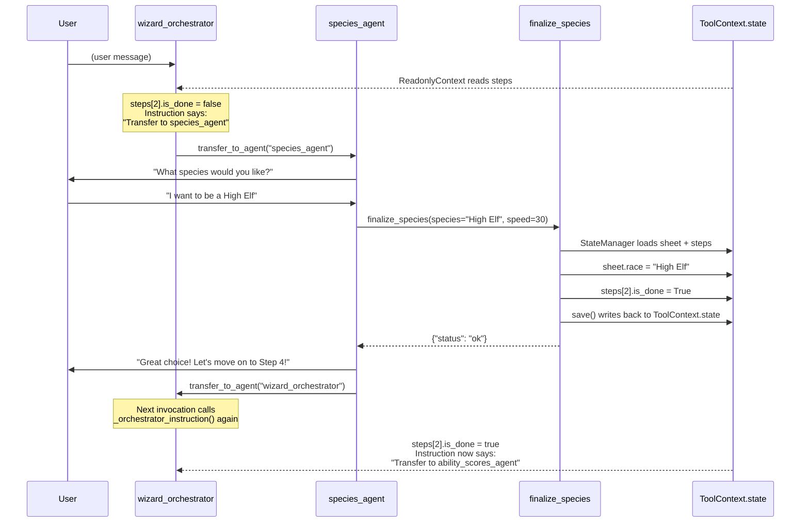

# Google ADK Wizard Builder

A D&D 5e Wizard character builder using [Google's Agent Development Kit](https://google.github.io/adk-docs/). This is my favorite, so far, on three strengths: sub-agent delegation, clean orchestrator routing, and state-driven instruction generation.

## What Made This Work

### Sub-Agent Delegation

ADK's [`LlmAgent`](https://google.github.io/adk-docs/agents/llm-agents/) takes a `tools` list that scopes which functions the agent can call. The orchestrator never answers D&D questions itself. Each of the 8 character creation steps is a dedicated `LlmAgent` with its own prompt and scoped tool set:

| Step | Agent | Tools |
|------|-------|-------|
| 1. Name | `name_agent` | `finalize_name` |
| 2. Background | `background_agent` | `query_rag`, `finalize_background` |
| 3. Species | `species_agent` | `query_rag`, `finalize_species` |
| 4. Ability Scores | `ability_scores_agent` | `roll_ability_score`, `finalize_ability_scores`, `query_rag` |
| 5. Alignment | `alignment_agent` | `finalize_alignment` |
| 6. Spells | `spells_agent` | `query_rag`, `finalize_spells` |
| 7. Equipment | `equipment_agent` | `finalize_equipment`, `query_rag` |
| 8. Personality | `personality_agent` | `finalize_personality` |

The `background_agent` can query RAG and finalize a background, but can't touch spells or ability scores. This prevents agents from skipping ahead or corrupting unrelated state.

Tools are plain Python functions. ADK [introspects the signature](https://google.github.io/adk-docs/tools-custom/function-tools/) (name, docstring, type hints) to generate a schema for the LLM. If a function declares a `tool_context: ToolContext` parameter, ADK injects it automatically.

### Routing via `transfer_to_agent`

The orchestrator declares all step agents as [`sub_agents`](https://google.github.io/adk-docs/agents/multi-agents/). ADK automatically provides each sub-agent with a built-in `transfer_to_agent` tool. When the LLM calls `transfer_to_agent(agent_name="wizard_orchestrator")`, ADK intercepts the call, looks up the target via `root_agent.find_agent()`, and updates the invocation context to route there. No custom routing code needed.

Each step prompt ends with an explicit transfer directive:

```
# From prompts/name.j2
If it succeeds:
1. Welcome them by name...
2. Say "Let's move on to Step 2!"
3. IMMEDIATELY call transfer_to_agent(agent_name="wizard_orchestrator")
```

The agent finalizes its data, summarizes for the user, and hands control back to the orchestrator.

### State-Driven Instruction Generation

`LlmAgent`'s `instruction` parameter [accepts a callable](https://google.github.io/adk-docs/agents/llm-agents/). Instead of a static string, we pass a function that reads [session state](https://google.github.io/adk-docs/sessions/state/) and generates a new instruction on every invocation:

```python
orchestrator = LlmAgent(
    ...
    instruction=_orchestrator_instruction,  # callable, not a string
    sub_agents=[name_agent, background_agent, ...],
    before_agent_callback=_initialize_state,
)
```

The callable receives a [`ReadonlyContext`](https://google.github.io/adk-docs/context/), which provides read access to `ctx.state`. `_orchestrator_instruction` reads the `steps` array and builds routing rules dynamically:

- No steps done? Greet the user, transfer to `name_agent`
- All steps done? Congratulate them, don't transfer
- Partial progress? Find the next incomplete step, transfer there

The instruction also embeds a live progress checklist:

```
<progress>
- [x] Name → `name_agent`
- [x] Background → `background_agent`
- [ ] Species → `species_agent`
- [ ] Ability Scores → `ability_scores_agent`
...
</progress>
```

The orchestrator doesn't decide where to route. The instruction tells it exactly what to do based on current state. Routing is deterministic, not probabilistic.

### Dynamic Spell Budget

Most step agents use static Jinja2 templates, but the spells agent needs numbers that depend on earlier choices. A Sage background grants Magic Initiate (2 extra cantrips + 1 bonus spellbook spell), and a High Elf gets a bonus cantrip. Hardcoding these would break for different builds.

Since `instruction` accepts a callable, the spells agent uses `_spells_instruction(ctx: ReadonlyContext)` to read the character sheet from `ctx.state`, compute the spell budget, and render a template with the correct numbers:

```python
def _spells_instruction(ctx: ReadonlyContext) -> str:
    sheet = CharacterSheet.model_validate_json(ctx.state.get("sheet", "{}"))
    has_magic_initiate = sheet.background in _SAGE_BACKGROUNDS
    total_cantrips = 3 + (2 if has_magic_initiate else 0) + (1 if sheet.race in _BONUS_CANTRIP_SPECIES else 0)
    total_spellbook = 6 + (1 if has_magic_initiate else 0)
    prepared_count = max(((sheet.intelligence or 10) - 10) // 2 + 1, 1)
    return _prompt("spells", total_cantrips=total_cantrips, total_spellbook=total_spellbook, ...)
```

The template gives unambiguous instructions like "pick **7** first-level spells" instead of asking the LLM to reason about feat interactions.

### Session State and the `StateManager` Wrapper

ADK's [session state](https://google.github.io/adk-docs/sessions/state/) is a dict of serializable key-value pairs, accessible via `ToolContext.state` inside tools or `ReadonlyContext.state` inside instruction callables. The framework tracks mutations automatically. State is scoped to the session and persisted by the configured [`SessionService`](https://google.github.io/adk-docs/sessions/session/) (we use `InMemorySessionService`).

Since `ToolContext.state` is a flat dict, we wrap it in `StateManager` for ergonomics: it deserializes the character sheet and step list on init, provides typed access and a `mark_step_done()` helper (which uses `ToolContext.agent_name` to identify the current step), and serializes everything back on `save()`:

```python
class StateManager:
    def __init__(self, tc: ToolContext) -> None:
        self.sheet = CharacterSheet.model_validate_json(tc.state.get("sheet", "{}"))
        self.steps: list[Step] = tc.state.get("steps", [])

    def mark_step_done(self) -> None:
        for step in self.steps:
            if step.agent_name == self._tc.agent_name:
                step.is_done = True
                break

    def save(self) -> None:
        self._tc.state["sheet"] = self.sheet.model_dump_json(by_alias=True)
        self._tc.state["steps"] = self.steps
```

Every finalize tool follows the same pattern: wrap `ToolContext` in `StateManager`, mutate the sheet, mark done, save.

### State Initialization via `before_agent_callback`

ADK [callbacks](https://google.github.io/adk-docs/callbacks/) fire at specific execution points. We use `before_agent_callback` on the orchestrator to seed the session with an empty character sheet and step list on first contact. The callback receives a mutable `CallbackContext` (unlike the read-only context in instruction callables):

```python
def _initialize_state(callback_context: CallbackContext) -> None:
    if "steps" not in callback_context.state:
        callback_context.state["steps"] = [s.model_copy() for s in _STEPS]
        callback_context.state["sheet"] = CharacterSheet().model_dump_json(by_alias=True)
```

This runs before the orchestrator's instruction is evaluated, so the first call to `_orchestrator_instruction` always has state to read.

## How a Single Step Works



The key insight: **the orchestrator's instructions are rewritten every turn based on state**. No routing logic lives in the LLM. A function reads a checklist, generates an unambiguous directive, the LLM follows it, the tool updates state, and the new state changes the next instruction.

## ADK Features Used

| ADK Feature | What It Does Here |
|---|---|
| [`LlmAgent`](https://google.github.io/adk-docs/agents/llm-agents/) | 9 agents (1 orchestrator + 8 steps), each with scoped tools and prompts |
| [`sub_agents`](https://google.github.io/adk-docs/agents/multi-agents/) | Orchestrator declares step agents; ADK provides `transfer_to_agent` automatically |
| [`instruction` callable](https://google.github.io/adk-docs/agents/llm-agents/) | Orchestrator and spells agent recompute their prompt every turn from state |
| [`ReadonlyContext`](https://google.github.io/adk-docs/context/) | Instruction callables read `ctx.state` without mutating it |
| [`ToolContext`](https://google.github.io/adk-docs/context/) | Tools read/write session state; `.agent_name` identifies current agent |
| [`before_agent_callback`](https://google.github.io/adk-docs/callbacks/) | Seeds session state on first contact via mutable `CallbackContext` |
| [Function tools](https://google.github.io/adk-docs/tools-custom/function-tools/) | Plain Python functions; ADK introspects signatures to generate LLM schemas |
| [`InMemorySessionService`](https://google.github.io/adk-docs/sessions/session/) | Stores session state in memory; swappable for database-backed services |
| [`Runner.run_async`](https://google.github.io/adk-docs/runtime/) | Async event stream powering SSE to the frontend |
| [`LiteLlm`](https://google.github.io/adk-docs/agents/models/) | Model abstraction via [LiteLLM](https://docs.litellm.ai/docs/#litellm-python-sdk); any supported provider works |

## Setup

### 1. Configure environment

Copy `.env.example` to `.env` and set the `MODEL` variable to any [LiteLLM-compatible model string](https://docs.litellm.ai/docs/#litellm-python-sdk). Set the corresponding API key or auth for your provider:

```bash
cp .env.example .env
```

```bash
# Gemini via Vertex AI (requires `gcloud auth application-default login`)
MODEL=vertex_ai/gemini-2.5-flash
GOOGLE_CLOUD_PROJECT=your-gcp-project-id
GOOGLE_CLOUD_LOCATION=us-central1

# OpenAI
MODEL=gpt-4.1
OPENAI_API_KEY=sk-...

# Anthropic
MODEL=anthropic/claude-sonnet-4-20250514
ANTHROPIC_API_KEY=sk-ant-...
```

### 2. Build the RAG index

```bash
make index
```

Chunks the 2024 PHB markdown sources into ChromaDB (`chroma_db/`). Run once, or re-run after updating sources.

### 3. Start the server

```bash
make up
```

## Development

```bash
uv run ruff format      # format
uv run ruff check       # lint
uv run ty check         # type check
uv run pytest           # tests
uv run uv lock --check  # verify lock file
```
