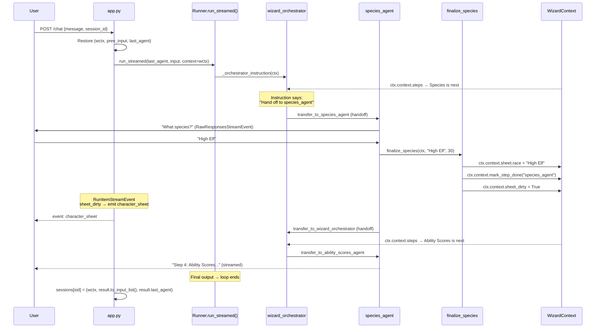

# OpenAI Agents SDK Wizard Builder

A D&D 5e Wizard character builder using the [OpenAI Agents SDK](https://openai.github.io/openai-agents-python/).

## What Made This Work

### Typed Shared Context

The SDK provides [`RunContextWrapper[T]`](https://openai.github.io/openai-agents-python/context/) for sharing non-LLM state across agents, tools, and lifecycles. One instance per run, typed, no serialization needed. We store the character sheet and step progress here:

```python
@dataclass
class WizardContext:
    sheet: CharacterSheet
    steps: list[Step]
    sheet_dirty: bool = False
```

We pass this to [`Runner.run_streamed(context=wctx)`](https://openai.github.io/openai-agents-python/running_agents/). Tools access it via `ctx.context` and mutate it directly. Changes are visible everywhere immediately:

```python
@function_tool
def finalize_name(ctx: RunContextWrapper[WizardContext], name: str) -> dict[str, object]:
    wc = ctx.context
    wc.sheet.name = name
    wc.mark_step_done("name_agent")
    wc.sheet_dirty = True
    return {"status": "ok"}
```

[`Agent`](https://openai.github.io/openai-agents-python/agents/) is generic over the context type (`Agent[WizardContext]`), so type checkers catch mismatches between agents and tools at check time.

### Handoffs

[Handoffs](https://openai.github.io/openai-agents-python/handoffs/) are first-class. We declare `handoffs=[...]` on each agent and the SDK generates `transfer_to_<agent_name>` tools for the LLM. When the LLM calls one, the SDK switches the active agent and continues the run loop.

```python
orchestrator = Agent[WizardContext](
    name="wizard_orchestrator",
    instructions=_orchestrator_instruction,
    handoffs=[handoff(agent=a) for a in step_agents],
)

for a in step_agents:
    a.handoffs = [handoff(agent=orchestrator)]
```

Step agents hand back to the orchestrator when done. The orchestrator reads updated context and routes to the next step. `handoff()` also supports [`on_handoff`, `input_type`, `input_filter`, and `is_enabled`](https://openai.github.io/openai-agents-python/handoffs/), but we don't use them since the typed context already carries everything.

### Function Tools

[`@function_tool`](https://openai.github.io/openai-agents-python/tools/) decorates a Python function to make it callable by the LLM. The SDK introspects the signature via `inspect`, builds a Pydantic model for the JSON schema, and parses docstrings via `griffe` for parameter descriptions. If the first parameter is `RunContextWrapper[T]`, the SDK injects it and hides it from the schema:

```python
@function_tool
def finalize_species(ctx: RunContextWrapper[WizardContext], race: str, speed: int) -> dict[str, object]:
    """Finalize species selection.

    Args:
        race: The chosen species name.
        speed: Walking speed in feet.
    """
    wc = ctx.context
    wc.sheet.race = race
    wc.sheet.speed = speed
    wc.mark_step_done("species_agent")
    wc.sheet_dirty = True
    return {"status": "ok"}
```

### Dynamic Instructions

`Agent`'s `instructions` accepts a static string or a [callable](https://openai.github.io/openai-agents-python/agents/) `(RunContextWrapper[T], Agent[T]) -> str`. We use a callable for the orchestrator so it reads step progress from context and generates routing rules each turn:

```python
def _orchestrator_instruction(ctx: RunContextWrapper[WizardContext], _agent: Agent[WizardContext]) -> str:
    wc = ctx.context
    if not any(s.is_done for s in wc.steps):
        # New session: greet and hand off to name_agent
    elif all(s.is_done for s in wc.steps):
        # All done: congratulate
    else:
        nxt = next(s for s in wc.steps if not s.is_done)
        # Hand off to next incomplete step
```

The generated instruction includes a progress checklist and explicit routing. The LLM follows the instruction rather than deciding where to route. The spells agent uses the same pattern to compute spell budgets from the character sheet.

### Streaming

[`Runner.run_streamed()`](https://openai.github.io/openai-agents-python/streaming/) returns a `RunResultStreaming`. We iterate [`result.stream_events()`](https://openai.github.io/openai-agents-python/ref/stream_events/) which yields events at three levels:

| Event Type | Contents | Our Use |
|---|---|---|
| `RawResponsesStreamEvent` | Token-by-token text deltas | Stream to the user via SSE |
| `RunItemStreamEvent` | Completed items: `tool_output`, `handoff_requested`, etc. | Check `sheet_dirty`, emit character sheet |
| `AgentUpdatedStreamEvent` | Agent switched during handoff | Log which agent took over |

```python
async for event in result.stream_events():
    if isinstance(event, RawResponsesStreamEvent):
        yield f"data: {json.dumps(delta)}\n\n"
    elif isinstance(event, RunItemStreamEvent):
        if event.item.type == "tool_call_output_item" and wctx.sheet_dirty:
            yield f"event: character_sheet\ndata: {sheet_json}\n\n"
    elif isinstance(event, AgentUpdatedStreamEvent):
        log.info("Handoff → %s", event.new_agent.name)
```

### Conversation Continuity

Between HTTP requests we store the `WizardContext`, the conversation history (via [`result.to_input_list()`](https://openai.github.io/openai-agents-python/running_agents/)), and [`result.last_agent`](https://openai.github.io/openai-agents-python/ref/result/). On the next request we append the new message and pass everything back:

```python
sessions[sid] = (wctx, result.to_input_list(), result.last_agent)
# Next request:
run_input = [*prev_input, {"role": "user", "content": req.message}]
Runner.run_streamed(starting_agent=last_agent, input=run_input, context=wctx)
```

Storing `last_agent` means we resume from whichever agent was active, not always the orchestrator.

## How a Single Step Works



**State drives the orchestrator's instructions.** The context is a live Python object that tools mutate directly and the instruction callable reads directly. Handoffs are SDK primitives. No custom routing or serialization.

## SDK Features Used

| SDK Feature | What It Does Here |
|---|---|
| [`Agent[T]`](https://openai.github.io/openai-agents-python/agents/) | 9 agents typed with `WizardContext`; type checker catches context mismatches |
| [`handoff()`](https://openai.github.io/openai-agents-python/handoffs/) | Bidirectional links between orchestrator and step agents; generates `transfer_to_*` tools |
| [`@function_tool`](https://openai.github.io/openai-agents-python/tools/) | Introspects signatures and docstrings to generate LLM tool schemas |
| [`RunContextWrapper[T]`](https://openai.github.io/openai-agents-python/context/) | Injected into tools and instruction callables; typed `.context` access |
| [Dynamic `instructions`](https://openai.github.io/openai-agents-python/agents/) | Orchestrator and spells agent recompute their prompt every turn |
| [`Runner.run_streamed()`](https://openai.github.io/openai-agents-python/running_agents/) | Async streaming execution with `max_turns` safety limit |
| [`StreamEvent` types](https://openai.github.io/openai-agents-python/streaming/) | Three levels: raw deltas, completed items, agent switches |
| [`to_input_list()`](https://openai.github.io/openai-agents-python/running_agents/) | Extracts conversation history for multi-turn continuity |
| [`result.last_agent`](https://openai.github.io/openai-agents-python/ref/result/) | Tracks active agent at end of turn for correct resumption |
| [`LitellmModel`](https://openai.github.io/openai-agents-python/models/) | Model abstraction via [LiteLLM](https://docs.litellm.ai/docs/#litellm-python-sdk); any supported provider works |

## Setup

### 1. Configure environment

Copy `.env.example` to `.env` and set the `MODEL` variable to any [LiteLLM-compatible model string](https://docs.litellm.ai/docs/#litellm-python-sdk). Set the corresponding API key or auth for your provider:

```bash
cp .env.example .env
```

```bash
# Gemini via Vertex AI (requires `gcloud auth application-default login`)
MODEL=vertex_ai/gemini-2.5-flash
GOOGLE_CLOUD_PROJECT=your-gcp-project-id
GOOGLE_CLOUD_LOCATION=us-central1

# OpenAI
MODEL=gpt-4.1
OPENAI_API_KEY=sk-...

# Anthropic
MODEL=anthropic/claude-sonnet-4-20250514
ANTHROPIC_API_KEY=sk-ant-...
```

### 2. Build the RAG index

```bash
make index
```

### 3. Start the server

```bash
make up
```

## Development

```bash
uv run ruff format      # format
uv run ruff check       # lint
uv run ty check         # type check
uv run pytest           # tests
uv run uv lock --check  # verify lock file
```
