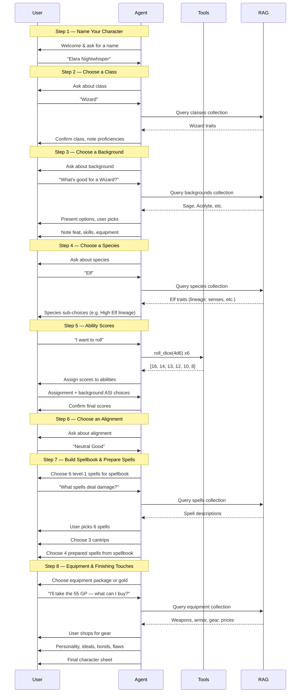

# Agent Spec

The specification for the character-building agent. Every framework implementation follows this spec — the same steps, tools, RAG usage, and character sheet contract.

This document defines the **steps** of the character-building conversation the agent must guide the user through. While the current challenge is building a Level 1 Wizard, the steps are written generically — any class could follow this same flow with class-specific details swapped in.

## Steps Overview

---

## Step 1: Name Your Character

The agent greets the user and asks for a character name up front. This lets the agent address the character by name throughout the rest of the conversation.

### What happens

1. Welcome the user to the Wizard Builder.
2. Ask for a character name.
3. The user can always change the name later in Step 8.

### Character sheet fields set

| Field | Value |
|---|---|
| `name` | The chosen name (e.g., `"Elara Nightwhisper"`) |

### Example conversation

> **Agent:** Welcome to the Wizard Builder! I'll guide you through creating a Level 1 D&D 5e (2024) Wizard, step by step. First things first — what would you like to name your character?
>
> **User:** Hmm, how about Elara Nightwhisper?
>
> **Agent:** Great name! Welcome, Elara. Let's build your wizard.

### Agent requirements

- None — this is a simple conversational exchange with no tools or RAG needed.

---

## Step 2: Choose a Class

The class is fixed to **Wizard** for this challenge, but the agent should still present it conversationally and explain what a Wizard is.

### What happens

1. Record class as Wizard.
2. Note class proficiencies from the Wizard table:
   - **Saving throws:** Intelligence, Wisdom
   - **Skills:** Choose 2 from: Arcana, History, Insight, Investigation, Medicine, Nature, Religion
   - **Weapons:** Simple weapons
   - **Armor:** None
3. Note Level 1 class features: Spellcasting, Ritual Adept, Arcane Recovery.
4. Note the hit die: d6.

### Character sheet fields set

| Field | Value |
|---|---|
| `save_profs` | `["int", "wis"]` |
| `features` | `["Spellcasting", "Ritual Adept", "Arcane Recovery"]` |

### Example conversation

> **Agent:** Now let's pick Elara's class. For this builder we're making a Wizard — a scholarly magic-user who studies the arcane arts. As a Wizard, Elara will be proficient in Intelligence and Wisdom saving throws, and she'll start with three class features: Spellcasting, Ritual Adept, and Arcane Recovery. Sound good, or do you have any questions about the class?
>
> **User:** What does Arcane Recovery do?
>
> **Agent:** Arcane Recovery lets you regain some spell slots after a Short Rest. At level 1, you can recover one level-1 spell slot. It's a great feature that gives Wizards more staying power than other casters between Long Rests. Ready to move on to choosing a background?

### Agent requirements

- **RAG:** Query `classes` collection for Wizard traits if the user asks questions.
- **Skill choice deferred** — the user picks their 2 Wizard class skills later in Step 3 alongside background skills (since they need to see the full picture before choosing).

---

## Step 3: Choose a Background

The background provides ability score increases, an origin feat, 2 skill proficiencies, a tool proficiency, and starting equipment.

### What happens

1. User picks a background (or asks for suggestions).
2. Record the background's fixed benefits:
   - **Feat:** Each background grants a specific Origin feat (e.g., Sage grants Magic Initiate (Wizard)).
   - **Skill proficiencies:** 2 specific skills per background.
   - **Tool proficiency:** 1 tool.
   - **Equipment:** A package or 50 GP.
3. The background's 3 listed ability scores determine which scores can receive the background ASI (applied in Step 5).
4. Combine background skill proficiencies with the class skill choices. The user now picks 2 class skills (from the Wizard list) that don't overlap with the background's skills.

### Character sheet fields set

| Field | Value |
|---|---|
| `background` | The chosen background (e.g., `"Sage"`) |
| `skill_profs` | Combined list: 2 from background + 2 from class |
| `equipment` | From the chosen equipment package |
| `gp` | Remaining gold |

### Cross-step dependencies

- The background's 3 ability scores constrain the ASI choices in Step 5.
- The Sage background grants **Magic Initiate (Wizard)**, which gives 2 extra cantrips and 1 extra level-1 spell — these are added in Step 7.

### Example conversation

> **Agent:** Time to choose Elara's background. This determines some of her skills, a feat, and which ability scores she can boost. For a Wizard, backgrounds with Intelligence are ideal. **Sage** is a classic pick — it gives Arcana and History proficiencies, the Magic Initiate (Wizard) feat for bonus cantrips and a spell, and ability boosts to Constitution, Intelligence, or Wisdom. Other good options include **Scribe** or **Criminal**. What sounds right for Elara?
>
> **User:** Sage fits perfectly. What does Magic Initiate give me exactly?
>
> **Agent:** Magic Initiate (Wizard) gives you 2 extra Wizard cantrips and 1 level-1 Wizard spell that's always prepared. We'll choose those specific spells later when we build Elara's spellbook. For now, Sage also gives you proficiency in Arcana and History. Since Arcana is also on the Wizard's class skill list, you'll want to pick 2 class skills that don't overlap — how about Insight and Investigation?
>
> **User:** Let's go with Insight and Investigation.
>
> **Agent:** Done! Elara's skill proficiencies are: Arcana, History (from Sage), and Insight, Investigation (from Wizard).

### Agent requirements

- **RAG:** Query `backgrounds` collection to describe options and answer questions.
- **RAG:** Query `feats` collection to explain the origin feat the background grants.

---

## Step 4: Choose a Species

Species determines size, speed, and special traits.

### What happens

1. User picks a species.
2. Record species traits:
   - **Size** (Medium or Small; some species let the user choose).
   - **Speed** (usually 30 ft; Wood Elf and Goliath get 35 ft).
   - **Special traits** — vary widely by species.
3. Some species require sub-choices:
   - **Elf:** Choose a lineage (Drow, High Elf, Wood Elf) which grants cantrips/spells.
   - **Gnome:** Choose Forest Gnome or Rock Gnome.
   - **Dragonborn:** Choose a draconic ancestry (damage type).
   - **Goliath:** Choose a giant ancestry (supernatural boon).
   - **Tiefling:** Choose a fiendish legacy (Abyssal, Chthonic, Infernal).
   - **Aasimar/Human:** Choose size (Medium or Small).
4. **Human** is special — gets an extra skill proficiency (`Skillful`) and a free Origin feat of their choice (`Versatile`).

### Character sheet fields set

| Field | Value |
|---|---|
| `species` | The chosen species |
| `speed` | From species (30 or 35) |

### Cross-step dependencies

- **Human's Versatile trait** grants an additional Origin feat — this could be *any* Origin feat, including Magic Initiate (Wizard), which adds spells in Step 7. The agent must track this and integrate it with spellcasting choices.
- **High Elf lineage** grants the Prestidigitation cantrip (or a replacement Wizard cantrip after each Long Rest). This doesn't count against the Wizard's cantrip limit.
- **Species cantrips/spells** use the species' spellcasting ability (user chooses INT/WIS/CHA), not necessarily the Wizard's INT.
- **Elf's Keen Senses** grants proficiency in one of Insight, Perception, or Survival — this adds to the skill proficiency list from Step 3.
- **Dwarf's Dwarven Toughness** adds +1 HP per level — affects `hp_max` in Step 5.

### Example conversation

> **Agent:** Next up — Elara's species. This determines traits like Darkvision, special abilities, and speed. The 2024 PHB offers 10 species. Any idea what you'd like, or want me to suggest some that pair well with Wizards?
>
> **User:** I'm thinking Elf. What are the options there?
>
> **Agent:** Elves get Darkvision (60 ft), Fey Ancestry (advantage against being charmed), Trance (4-hour long rests), and proficiency in one of Insight, Perception, or Survival. You also choose a lineage:
> - **High Elf** — a free Wizard cantrip (Prestidigitation, swappable on long rests). Perfect synergy with Wizard.
> - **Drow** — 120 ft Darkvision and the Dancing Lights cantrip.
> - **Wood Elf** — 35 ft speed and the Druidcraft cantrip.
>
> **User:** High Elf for sure. And I'll take Perception for the skill.
>
> **Agent:** Excellent. Elara is a High Elf with Darkvision, Fey Ancestry, Trance, Perception proficiency, and the Prestidigitation cantrip (which doesn't count against her Wizard cantrip limit). Her speed is 30 ft.

### Agent requirements

- **RAG:** Query `species` collection to describe options, traits, and sub-choices.
- **RAG:** Query `spells` collection if the species grants cantrips/spells and the user wants details.

---

## Step 5: Determine Ability Scores

Ability scores are the numerical foundation of the character.

### What happens

1. **Generate scores** — the user picks one of three methods:
   - **Standard Array:** `[15, 14, 13, 12, 10, 8]` — no tools needed.
   - **Rolling:** Roll 4d6, drop the lowest, six times — **requires the dice-rolling tool**.
   - **Point Buy:** 27 points to spend using a cost table — the agent must validate the math.
2. **Assign scores** to the six abilities (STR, DEX, CON, INT, WIS, CHA). The Wizard Standard Array suggestion is: STR 8, DEX 12, CON 13, INT 15, WIS 14, CHA 10.
3. **Apply background ASI** — the background lists 3 ability scores. The user either increases one by +2 and another by +1, or all three by +1. No score can exceed 20.
4. **Compute derived values:**
   - `hp_max` = 6 + CON modifier (+ 1 if Dwarf, + twice character level if Tough feat)
   - `ac` = 10 + DEX modifier (13 + DEX modifier with Mage Armor active)
   - Ability modifiers = `floor((score - 10) / 2)`

### Character sheet fields set

| Field | Value |
|---|---|
| `str`, `dex`, `con`, `int`, `wis`, `cha` | Final scores after ASI |
| `hp_max` | 6 + CON modifier (+ racial/feat bonuses) |
| `ac` | 10 + DEX modifier |
| `attacks` | Computed from weapons + ability modifiers |

### Example conversation

> **Agent:** Now let's determine Elara's ability scores. You have three options:
> 1. **Standard Array** — use the preset scores: 15, 14, 13, 12, 10, 8
> 2. **Roll** — roll 4d6, drop the lowest, six times
> 3. **Point Buy** — spend 27 points to customize scores
>
> Which method appeals to you?
>
> **User:** Let's roll! I like the excitement.
>
> **Agent:** Rolling 4d6 drop lowest, six times... 🎲
> 1. Rolled [4, 3, 5, 2] → drop the 2 → **12**
> 2. Rolled [6, 4, 5, 3] → drop the 3 → **15**
> 3. Rolled [3, 6, 6, 1] → drop the 1 → **15**
> 4. Rolled [4, 2, 5, 4] → drop the 2 → **13**
> 5. Rolled [5, 3, 2, 4] → drop the 2 → **12**
> 6. Rolled [6, 5, 4, 3] → drop the 3 → **15**
>
> Your scores are: **15, 15, 15, 13, 12, 12**. Nice rolls! How would you like to assign them? For a Wizard, Intelligence should get a high score. I'd suggest: STR 12, DEX 15, CON 13, INT 15, WIS 15, CHA 12.
>
> **User:** Looks good, but I'd swap DEX and CON.
>
> **Agent:** Done — STR 12, DEX 13, CON 15, INT 15, WIS 15, CHA 12. Now for the background adjustment: Sage lets you boost Constitution, Intelligence, or Wisdom. You can put +2 in one and +1 in another, or +1 in all three.
>
> **User:** +2 INT, +1 CON.
>
> **Agent:** Final scores: STR 12, DEX 13, CON 16, INT 17, WIS 15, CHA 12. That gives Elara an INT modifier of +3 (great for spellcasting) and a CON modifier of +3 (HP max = 6 + 3 = 9). AC is 11 (10 + DEX mod).

### Agent requirements

- **Tool:** `roll_dice` — roll NdM dice (e.g., `roll_dice(4, 6)` returns individual results so the user can see which die was dropped). Called 6 times for the rolling method.
- **Validation:** If using Point Buy, the agent must enforce the cost table and the 27-point budget.
- **Validation:** Background ASI cannot raise any score above 20.

---

## Step 6: Choose an Alignment

A simple conversational choice.

### What happens

1. Present the 9 alignments.
2. User picks one.
3. Optionally use the alignment to inspire personality traits (the PHB has a d4 table per alignment axis).

### Character sheet fields set

| Field | Value |
|---|---|
| `alignment` | The chosen alignment (e.g., `"Neutral Good"`) |

### Example conversation

> **Agent:** What alignment should Elara have? The nine alignments range from Lawful Good to Chaotic Evil. For context, alignment describes a character's moral compass — it won't affect gameplay mechanics, but it helps shape roleplaying. What feels right for a scholarly wizard?
>
> **User:** Neutral Good — she wants to help people but doesn't care much about rules.
>
> **Agent:** Neutral Good it is. Elara does the best she can, working within rules but not feeling bound by them.

### Agent requirements

- **RAG:** Query `rules` collection if the user asks what an alignment means or wants the personality trait tables.

---

## Step 7: Build Spellbook & Prepare Spells

This is the most complex step. Wizards have a **spellbook** (all spells they know) and **prepared spells** (the subset they can cast on a given day). They also know a fixed number of cantrips.

### What happens

1. **Choose 3 cantrips** from the Wizard cantrip list (20 options). These are always available.
2. **Choose 6 level-1 spells** for the spellbook (32 options). The spellbook is the wizard's full repertoire.
3. **Choose 4 prepared spells** from the spellbook. These are the spells the wizard can cast today (using their 2 level-1 spell slots).
4. **Add bonus spells** from other sources:
   - Background feat (e.g., Sage's Magic Initiate (Wizard) grants 2 cantrips + 1 level-1 spell, always prepared).
   - Human's Versatile feat (if they picked Magic Initiate).
   - Species spells (e.g., High Elf's Prestidigitation cantrip, Drow's Dancing Lights).
5. **Compute attack entries** for offensive cantrips:
   - `hit` = `"+"` + (INT modifier + proficiency bonus)
   - `damage` = the cantrip's damage dice + type (e.g., `"1d10 fire"` for Fire Bolt)

### Character sheet fields set

| Field | Value |
|---|---|
| `cantrips` | List of cantrip objects (`{name, hit?, damage?}`) |
| `spells` | List of prepared spell objects (`{name, level, school, ritual?, concentration?, description?}`) |
| `spellbook` | List of all 6 known level-1 spells |

### Example conversation

> **Agent:** Now for the fun part — Elara's magic! We need to make three sets of choices:
> 1. **3 cantrips** — minor spells Elara always knows (plus Prestidigitation from High Elf and 2 bonus cantrips from Magic Initiate)
> 2. **6 level-1 spells** for her spellbook — her full repertoire
> 3. **4 prepared spells** from the spellbook — what she can cast today
>
> Let's start with cantrips. There are 20 Wizard cantrips to choose from. Want me to list them, or do you have a preference for offense vs. utility?
>
> **User:** What are the best damage cantrips?
>
> **Agent:** Here are the top offensive Wizard cantrips:
> - **Fire Bolt** — 1d10 fire damage, 120 ft range. Best raw damage.
> - **Ray of Frost** — 1d8 cold damage, 60 ft, reduces target's speed by 10 ft.
> - **Shocking Grasp** — 1d8 lightning, melee range, but the target can't take reactions (great for escaping).
> - **Chill Touch** — 1d8 necrotic, 120 ft, prevents healing.
> - **Toll the Dead** — 1d8 necrotic (WIS save), 1d12 if the target is injured.
>
> **User:** Fire Bolt, Ray of Frost, and Mind Sliver for my three. What does Mind Sliver do?
>
> **Agent:** Mind Sliver forces an INT save — on a fail, the target takes 1d6 psychic damage and subtracts 1d4 from its next saving throw. It's excellent for setting up big spells next turn. Great pick! Now, with your 2 Magic Initiate cantrips, you can choose 2 more — want utility or more offense?

### Agent requirements

- **RAG:** Query `spells` collection — this is essential. Users will ask "what spells deal fire damage?", "which spells are rituals?", "what's the best defensive spell?", etc. The agent must surface spell descriptions from RAG, not hallucinate them.
- **Validation:** Prepared spells must be a subset of the spellbook. Cantrip count must not exceed the limit (3 from class + any bonus from species/feat). Spellbook must contain exactly 6 level-1 Wizard spells.

---

## Step 8: Equipment & Finishing Touches

### What happens

1. **Confirm equipment.** The Wizard gets a choice:
   - **(A)** 2 Daggers, Arcane Focus (Quarterstaff), Robe, Spellbook, Scholar's Pack, 5 GP
   - **(B)** 55 GP (and buy equipment manually)
   - Plus any equipment from the background.
2. **Compute weapon attacks:**
   - Quarterstaff: hit = STR modifier + proficiency, damage = 1d6 + STR modifier bludgeoning
   - Dagger: hit = DEX modifier + proficiency (finesse), damage = 1d4 + DEX modifier piercing
3. **Personality traits, ideals, bonds, flaws** — the user writes these or the agent suggests options inspired by the alignment and background.
4. **Emit the final character sheet** as a `character_sheet` SSE event.

### Character sheet fields set

| Field | Value |
|---|---|
| `equipment` | Full equipment list |
| `gp` | Remaining gold |
| `attacks` | Weapon attack objects |
| `personality` | Personality traits |
| `ideals` | Ideals |
| `bonds` | Bonds |
| `flaws` | Flaws |

### Example conversation

> **Agent:** Almost done! Let's sort out Elara's equipment. The Wizard class offers two options:
> - **(A)** 2 Daggers, Arcane Focus (Quarterstaff), Robe, Spellbook, Scholar's Pack, and 5 GP
> - **(B)** 55 GP to buy your own gear
>
> You also have the Sage equipment: Quarterstaff, Calligrapher's Supplies, Book (history), Parchment (8 sheets), Robe, and 8 GP. Want the standard kit or the gold?
>
> **User:** I'll take option A. And I already get a Quarterstaff from Sage — do I get two?
>
> **Agent:** Good catch! The Arcane Focus (Quarterstaff) from the Wizard kit and the Quarterstaff from Sage are the same item — you'd just use one as your arcane focus. Your final equipment: Spellbook, Arcane Focus (Quarterstaff), 2 Daggers, Robe, Scholar's Pack, Calligrapher's Supplies, Book (history), 8 sheets of Parchment, and 13 GP total. Now, let's add some personality. What are Elara's personality traits, ideals, bonds, and flaws?
>
> **User:** She's bookish and curious, always quoting obscure texts. Her ideal is that knowledge should be free. Her bond is her spellbook. Her flaw is she's blunt and accidentally insults people.
>
> **Agent:** Love it! Here's Elara's completed character sheet.

### Agent requirements

- **RAG:** Query `equipment` collection if the user asks about weapon stats, armor, or gear.

---

## Tools

Every agent implementation must expose these tools to the LLM:

| Tool | Signature | Description |
|---|---|---|
| `roll_dice` | `roll_dice(count: int, sides: int) -> list[int]` | Roll `count` dice with `sides` faces. Returns individual results. Used for ability score generation (4d6 drop lowest), random tables, and any other dice roll the user requests. |

The `roll_dice` tool exists because the LLM must not simulate randomness — real dice rolls must come from a tool backed by a real RNG.

---

## RAG Collections

The agent uses ChromaDB for retrieval. See [RAG_SPEC.md](RAG_SPEC.md) for setup details.

| Collection | When queried |
|---|---|
| `classes` | Step 2 — describing class features, proficiencies, spell slot progression |
| `backgrounds` | Step 3 — listing backgrounds, their ASI scores, feats, skills, equipment |
| `species` | Step 4 — species traits, sub-choices (lineages, ancestries) |
| `feats` | Step 3/4 — explaining origin feats granted by backgrounds or Human's Versatile trait |
| `spells` | Step 7 — spell descriptions, filtering by school/level/ritual/damage type |
| `equipment` | Step 8 — weapon stats, gear descriptions, prices |
| `rules` | Any step — general rules (e.g., how modifiers work, what concentration means) |

---

## Character Sheet Emission

The agent should emit `character_sheet` SSE events **incrementally** as choices are confirmed — not just at the end. This keeps the frontend's character sheet pane updating in real time as the conversation progresses.

For example:
- After Step 1: emit `{"name": "Elara Nightwhisper"}`
- After Step 2: emit `{"features": ["Spellcasting", "Ritual Adept", "Arcane Recovery"], "save_profs": ["int", "wis"]}`
- After Step 3: emit `{"background": "Sage", "skill_profs": ["arcana", "history", "insight", "investigation"]}`
- After Step 5: emit `{"str": 8, "dex": 14, "con": 13, "int": 17, "wis": 12, "cha": 10, "hp_max": 7, "ac": 12}`

This is a core part of the user experience and a good test of how each framework handles interleaving structured data output with conversational text.

---

## Generalizing Beyond Wizard

These steps generalize cleanly to any class. The class-specific variation points are:

1. **Step 1:** Naming is fully class-agnostic.
2. **Step 2:** Different hit die, saving throws, skill options, armor/weapon proficiencies, class features.
3. **Step 3:** Background interactions are class-agnostic — they work the same for every class.
4. **Step 4:** Species interactions are mostly class-agnostic. Some species grant spells/cantrips that only matter for spellcasting classes.
5. **Step 5:** Different classes have different primary abilities and different Standard Array suggestions. HP formula changes with the hit die (d6/d8/d10/d12).
6. **Step 6:** Alignment is fully class-agnostic.
7. **Step 7:** This step is only relevant for spellcasting classes, and the details differ significantly:
   - **Wizard:** Spellbook (knows many, prepares a subset) + cantrips.
   - **Cleric/Druid:** Access to entire class spell list, prepare a subset each day.
   - **Sorcerer/Bard/Warlock:** Fixed spells known, no preparation flexibility.
   - **Fighter/Rogue/Barbarian/Monk:** No spellcasting at level 1 (though some subclasses add it later). This step is skipped.
8. **Step 8:** Equipment packages differ by class. Weapon attack calculations differ based on class weapon proficiencies and fighting styles.

The multi-step orchestration architecture (one prompt/toolset per step) naturally supports this — you'd swap in class-specific step configurations rather than rewriting the flow.
